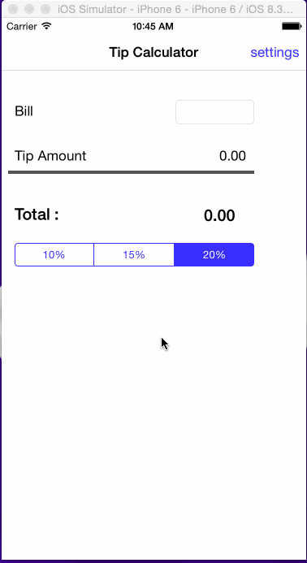

# Tip_Calculator

This is an demo application 

Time spent: 6 hours spent in total

Completed user stories:

 * [x] Required: User can enter a bill amount, choose a tip percentage, and see the tip and total values.
 * [x] Required: Settings page to change the default tip percentage.
 
 
Notes:

GIF created with [LiceCap](http://www.cockos.com/licecap/).

